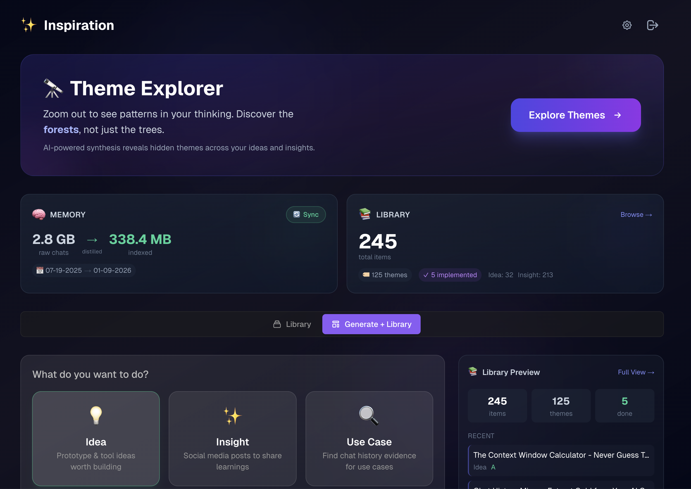

# ✨ Inspiration

> **Turn your AI coding conversations into a mirror for your thinking.**
> If you treat AI as a thinking partner (not just a code generator), you've been having months of conversations about what matters to you. Inspiration helps you see the patterns.




---

## 🧠 Who This Is For

**You're the right person for this if:**
- You use **Cursor or Claude Code** as a **thinking partner**, not just an autocomplete tool
- You've had that moment: *"I solved this before... where was that conversation?"*
- You keep notes, journals, or a "second brain"—but your AI chats aren't in it yet
- You're curious about **meta-analysis**: *"What patterns emerge when I look at 6 months of my conversations?"*
- You get excited by self-reflection: *"What was I thinking about 3 months ago vs. now?"*

**This tool is for pattern seekers and reflective builders.**

If you just want to ship code fast and don't care about longitudinal self-knowledge, this probably isn't for you. But if you're intellectually curious about your own thinking—if the idea of **"semantic search over your own conversations"** or **"LLM-synthesized themes of your interests"** sounds compelling—keep reading.

---

## 💡 What You Get

| Mode | What It Does | Why It's Interesting |
|------|-------------|---------------------|
| **🔭 Theme Explorer** | See patterns in your thinking—3 tabs: Patterns, Unexplored, Counter-Intuitive | Meta-cognition: What themes keep surfacing? What's missing? What should you challenge? |
| **💡 Ideas** | Surface recurring pain points worth building solutions for | Pattern recognition: Which of your 20 ideas keeps coming up in different contexts? |
| **✨ Insights** | Extract learnings worth sharing (blogs, tweets, research sparks) | Knowledge synthesis: What have you learned that's worth teaching others? |
| **🔍 Seek** | "I want to build X"—find similar examples from your own history | Self-search: Mine your past conversations for evidence and context |

**The more you use AI coding assistants as thinking partners, the more valuable your conversation history becomes.**

This isn't just about generating ideas—it's about **understanding your own intellectual trajectory**. What were you curious about 6 months ago? What patterns keep recurring? What did you learn but forget?

---

## 🚀 Quick Start (2 minutes)

```bash
# Clone & install
git clone https://github.com/mostly-coherent/Inspiration.git
cd Inspiration
npm install
pip install -r engine/requirements.txt

# Run
npm run dev
```

**→ Open http://localhost:3000**

That's it. The **onboarding wizard** handles everything else:

| Step | What Happens | You Need |
|------|-------------|----------|
| 1. Welcome | Detects your chat history size | Nothing |
| 2. API Keys | Enter your keys (validated before saving) | See below |
| 3. Sync | Indexes your chats (< 1 min for most users) | Nothing |
| **Done!** | → Theme Explorer shows patterns in your thinking | 🎉 |

### API Keys

| Key | Required? | What It Enables |
|-----|-----------|-----------------|
| **Anthropic** | ✅ Yes | Generation, theme synthesis, quality scoring |
| **OpenAI** | Optional | Deduplication, semantic search, library sync |
| **Supabase** | Optional | Scale to 500MB+ history with instant search |

> **Minimal setup:** Just Anthropic key → basic generation works immediately.  
> **Full power:** Add OpenAI key → deduplication and smarter Library management.

---

## ✨ Features

- **📚 Library System** — Accumulated ideas/insights with automatic deduplication and categorization
- **🧭 Unexplored Territory** — Find topics you discuss frequently but haven't captured yet; one-click "Enrich Library"
- **📄 Pagination** — Browse large libraries efficiently (50 items per page)
- **💰 Cost Estimation** — See estimated API cost before running generation
- **⚡ Optimized Harmonization** — pgvector RPC + parallel processing for 20-60x faster saves
- **⚙️ Time Presets** — Daily (24h), Sprint (14d), Month (30d), Quarter (90d) scans
- **🧠 Vector Memory** — Scale to 2GB+ chat history with Supabase pgvector (optional)
- **🔄 Multi-Source Support** — Auto-detects Cursor and Claude Code on macOS and Windows
- **🎨 Voice Matching** — Golden examples + voice guides for authentic style

---

## 🎯 How It Works

1. **Extract** — Reads from Cursor (SQLite) and Claude Code (JSONL) chat histories, automatically detecting both sources
2. **Index** — Optionally sync to Vector DB for massive histories
3. **Search** — Semantic queries find relevant conversations across months
4. **Synthesize** — Claude distills patterns into structured ideas or shareable insights
5. **Accumulate** — Library grows over time—value compounds
6. **Reflect** — Theme Explorer groups items dynamically for self-reflection
7. **Discover** — Unexplored Territory shows topics to explore next; one-click enrichment

---

## 🎯 Why This Is Intellectually Stimulating

**For reflective engineers and pattern seekers:**

- **Self-Discovery Through Data** — Run Theme Explorer and discover: *"I didn't realize I've been circling this problem for 6 months"*
- **Meta-Analysis** — It's like running analytics on your own brain. What patterns emerge when you have 500+ conversations indexed?
- **Pattern Recognition** — Theme Explorer's 3 tabs show patterns (what exists), unexplored territory (what's missing), and counter-intuitive prompts (what to challenge)
- **Compound Knowledge** — Your Library grows with every conversation. Watch your intellectual progress quantified.

**The "Aha Moment" User Story:**

> You run Theme Explorer on 6 months of conversations. At the "Forest" view (broad themes), you see: **"Developer tooling for async workflows."**
> 
> Zooming in shows specific themes: background jobs, webhooks, event-driven architecture.
> 
> The LLM synthesis reveals: *"This pattern appears in 12 conversations across 4 different projects. You keep encountering the same pain point: coordinating async tasks across services."*
> 
> **Your reaction:** *"Holy shit. I should build a unified async orchestration library. This is what I've been dancing around for months."*

**That's the value:** Seeing your own thinking from 10,000 feet.

---

## 🧠 What's Interesting Here

<details>
<summary>For the technically curious (click to expand)</summary>

### Engineering

| Aspect | What's Novel |
|--------|--------------|
| **Multi-Source Extraction** | Reverse-engineered Cursor's "Bubble" format (SQLite) and Claude Code's JSONL storage—both auto-detected with zero configuration |
| **Semantic Self-Search** | RAG over your *own* chat history for self-reflection (not documentation or StackOverflow) |
| **Dedup Before Presentation** | Generate N×1.5 items, deduplicate via embedding similarity before returning |
| **Hybrid Local/Cloud** | Local SQLite → Supabase Vector DB sync; works offline, scales to 2GB+ |

### Product

| Aspect | What's Interesting |
|--------|-------------------|
| **Library as Scoreboard** | The accumulated Library is the value prop—not each session. "Is my Library growing?" creates compound value |
| **Cross-Session Reflection** | Most dev tools focus on "do more"—this focuses on "learn from what you did" |
| **Introspection as Data Science** | Treating self-reflection as an analytics problem |

### What's NOT Groundbreaking

- **RAG pipeline:** Embed → vector search → retrieve → LLM synthesize (textbook pattern)
- **Item bank with clustering:** Cosine similarity grouping (standard knowledge management)
- **Multi-LLM fallback:** Anthropic → OpenAI → OpenRouter (standard resilience)

The innovation is **what** you're searching (your own AI coding conversations for meta-cognition), not **how** you're searching it.

</details>

---

## 🔮 What's Next

**Unexplored Territory is now live!** The app analyzes your Memory to find topics you discuss frequently but haven't captured yet. One click on "Enrich Library" auto-generates ideas and insights for that topic. Combined with performance optimizations (50-80% cost reduction via topic filtering, 20-60x faster harmonization), the Library grows efficiently with minimal manual intervention.

**Longitudinal Intelligence (3/3 complete):** Theme Explorer is fully operational with three tabs:
- **Patterns** — See what themes exist in your Library (zoom in/out)
- **Unexplored** — Find topics you discuss frequently but haven't extracted yet
- **Counter-Intuitive** — LLM-generated reflection prompts to challenge your assumptions

---

## 📚 Going Deeper

See `ARCHITECTURE.md` for system design, data flow, and technical details.

---

**Status:** Active | **Author:** [@mostly-coherent](https://github.com/mostly-coherent)
