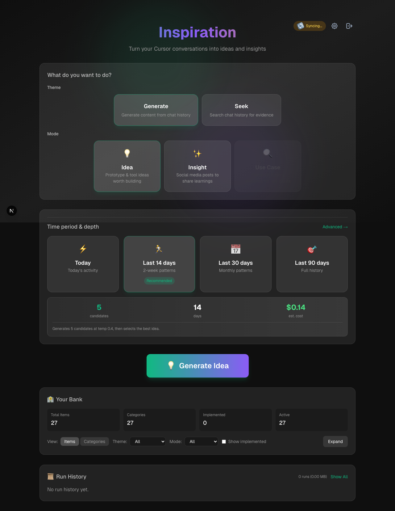

# ✨ Inspiration

> Turn your Cursor AI conversations into actionable ideas, shareable insights, and deduplicated knowledge banks.




## 🚀 Quick Start

```bash
# 1. Install
git clone https://github.com/mostly-coherent/inspiration.git
cd inspiration
npm install
pip install -r engine/requirements.txt

# 2. Configure (See CLAUDE.md for full setup)
echo "ANTHROPIC_API_KEY=sk-ant-..." > .env
# Optional: Add SUPABASE_URL/KEY for massive history support

# 3. Run
npm run dev
```

**→ Open http://localhost:3000**

---

<details>
<summary><strong>✨ Features</strong></summary>

- **💡 Ideas Generation:** Extract prototype and tool ideas worth building from chat history.
- **✨ Insight Generation:** Generate LinkedIn post drafts sharing your learnings.
- **🏦 Knowledge Banks:** Deduplicated, harmonized storage for ideas and insights.
- **⚙️ Preset Modes:** Daily, Sprint (14d), Month (30d), Quarter (90d) scans.
- **⚡ Best-of-N:** Generate multiple candidates and pick the best one.
- **🧠 Vector Brain:** Supports indexing >2GB of chat history using Supabase pgvector for O(1) search speeds.
- **🔄 Cross-Platform:** Auto-detects Cursor DB on macOS, Windows, and Linux.

</details>

<details>
<summary><strong>🎯 How It Works</strong></summary>

Inspiration reads your local Cursor chat history database (`state.vscdb`), extracts relevant conversations (handling complex "Bubble" architecture), and uses Claude Sonnet 4 to distill them into structured ideas or social content.

For power users with massive histories (>100MB), it can optionally index your chat logs into a private **Supabase Vector Database**, turning your history into an instantly searchable, persistent "Second Brain" independent of Cursor's local storage.

</details>

<details>
<summary><strong>📚 Development Notes</strong></summary>

- **Config:** `data/config.json` (created on first run)
- **Banks:** `data/idea_bank.json`, `data/insight_bank.json`
- **Engine:** Standalone Python scripts in `engine/` directory
- **Vector DB:** `engine/common/vector_db.py` and `engine/scripts/`
- See `CLAUDE.md` for detailed technical setup and architecture.
- See `PLAN.md` for product requirements.
- See `BUILD_LOG.md` for chronological progress.

</details>

---

**Status:** Active | **Purpose:** Personal productivity tool
