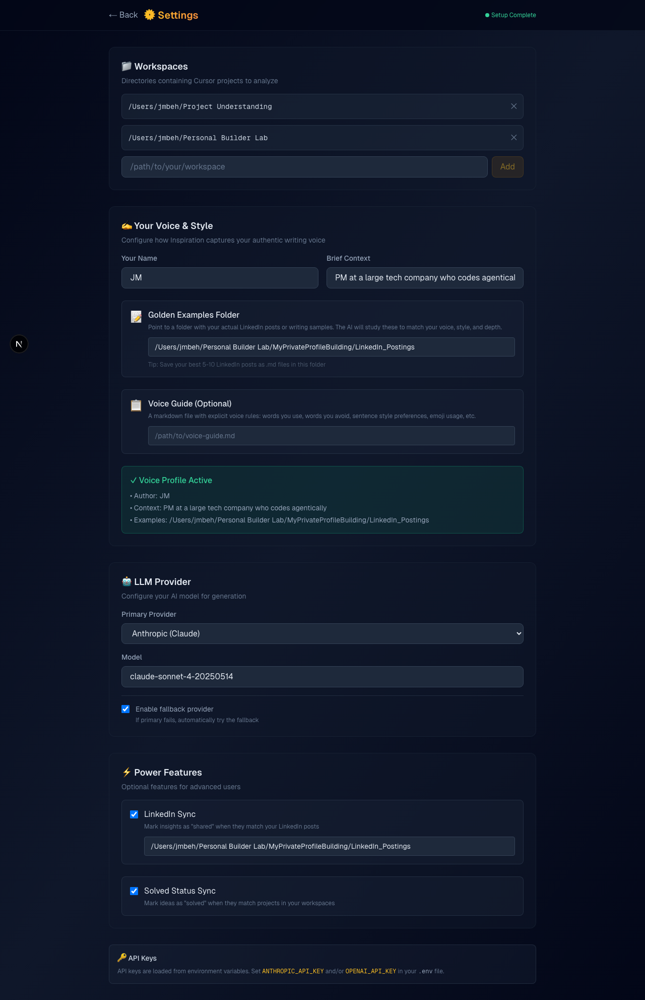

# ✨ Inspiration

> Turn your Cursor AI conversations into actionable ideas and shareable insights.


---

## Preview




---

## What It Does

Inspiration reads your Cursor chat history and uses Claude to:

- **💡 Ideas** — Extract prototype and tool ideas worth building
- **✨ Insights** — Generate LinkedIn post drafts sharing your learnings

It harmonizes outputs into deduplicated "banks" so you never see the same insight twice.

---

## Quick Start

### 1. Clone and Install

```bash
git clone https://github.com/mostly-coherent/inspiration.git
cd inspiration
npm install
pip install -r engine/requirements.txt
```

### 2. Set API Keys

Create a `.env` file in the project root:

```bash
ANTHROPIC_API_KEY=sk-ant-...
# Optional: OpenAI fallback
OPENAI_API_KEY=sk-...
```

### 3. Run

```bash
npm run dev
# Open http://localhost:3000
```

### 4. Configure (First Run)

The Settings wizard will guide you through:
1. **Workspaces** — Add your Cursor project folders
2. **Voice & Style** — Configure your authentic writing voice
3. **LLM Settings** — Choose your model
4. **Power Features** — Enable LinkedIn sync, solved status tracking

---

## Features

### Core

| Feature | Description |
|---------|-------------|
| **Preset Modes** | Daily, Sprint (14d), Month (30d), Quarter (90d) |
| **Best-of-N Generation** | Generate multiple candidates, pick the best |
| **Idea/Insight Banks** | Deduplicated, harmonized storage |
| **Progress UI** | Real-time progress, elapsed time, stop button |

### Power User (Optional)

| Feature | Description |
|---------|-------------|
| **Voice Profile** | Your name, context, golden examples, style guide |
| **LinkedIn Sync** | Mark insights as "shared" when matching posts |
| **Solved Status** | Mark ideas as "solved" when matching projects |
| **OpenAI Fallback** | Automatic fallback if Anthropic fails |

---

## Project Structure

```
inspiration/
├── src/app/              # Next.js pages
│   ├── page.tsx          # Main UI
│   ├── settings/         # Settings wizard
│   └── api/              # API routes
├── engine/               # Python generation engine
│   ├── ideas.py          # Idea generation
│   ├── insights.py       # Insight generation
│   ├── common/           # Shared utilities
│   └── prompts/          # LLM prompts
├── data/                 # User data (gitignored)
│   ├── config.json       # Your configuration
│   ├── idea_bank.json    # Your idea bank
│   └── insight_bank.json # Your insight bank
└── .env                  # API keys (gitignored)
```

---

## Voice Configuration

For authentic LinkedIn posts, configure your voice profile in Settings:

| Setting | Purpose |
|---------|---------|
| **Author Name** | Used in prompts (e.g., "JM") |
| **Author Context** | Brief background (e.g., "PM who codes agentically") |
| **Golden Examples** | Folder of your actual LinkedIn posts |
| **Voice Guide** | Explicit style rules (optional) |

The engine combines these to match your authentic voice.

---

## Cross-Platform Support

| OS | Cursor Database Path |
|----|----------------------|
| macOS | `~/Library/Application Support/Cursor/User/globalStorage/state.vscdb` |
| Windows | `%APPDATA%\Cursor\User\globalStorage\state.vscdb` |
| Linux | `~/.config/Cursor/User/globalStorage/state.vscdb` |

The engine auto-detects your OS.

---

## Tech Stack

| Layer | Technology |
|-------|------------|
| Frontend | Next.js 15, React 19, TypeScript |
| Styling | TailwindCSS |
| Backend | Next.js API Routes + Python subprocess |
| LLM | Claude Sonnet 4 (primary), GPT-4o (fallback) |

---

## License

MIT
